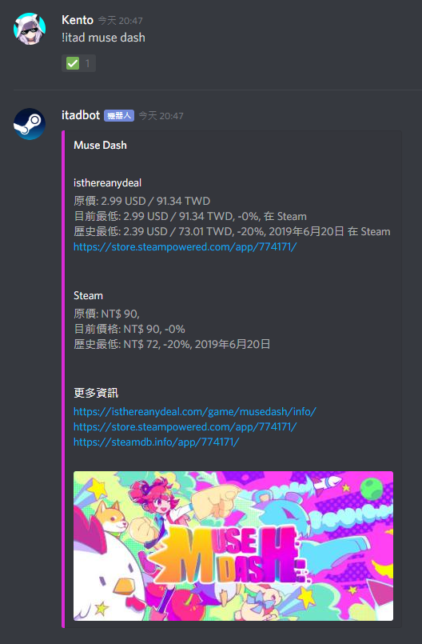

# Discordbot-Deals
A discord bot to get deals information of steam app.

# Deals Discord Bot
A discord bot to get deals information form [isthereanydeal.com](https://isthereanydeal.com)  
Click [here](https://discordapp.com/oauth2/authorize?client_id=634902541687324702&scope=bot&permissions=28832) to add the bot.  
  
  
  
## Install
- Create a `.env` file and add the following settings.
  ```
    # Your isthereanydeal API key
    ITAD_KEY=""

    # Your discord bot token
    DISCORD_TOKEN=""

    # Loading Emoji ID
    LOADING_EMOJI=""

    # If "true", print detail axios error object
    ERROR="false"
  ```

- Run `bun i` to install dependencies.
- Run `bun start` to start your bot.

## Docker
- Run `docker build -t discordbot-deals .` to build docker image.
- Run `docker run --name discordbot-deals -v "<your .env file path>:/app/.env" discordbot-deals` to start the bot.

## Commands
- `/itadhelp`
- `/itad <game-name>`
- `/itadid <steam-app-id>`
